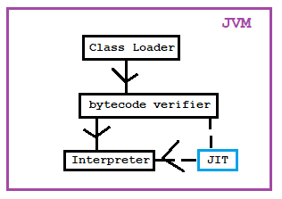

Q. Why Java is not 100% Object-Oriented Language?  
Ans: Java allows the primitive data types like int, float, double etc.

Q. Why pointers are not allowed in Java?  
Ans: Pointers are not safe. Pointers allocates or pointing the memory location, in Java the JVM does the same implicitly. So no need of pointers. To avoid the direct access of memory to users.

Q. What is JIT Compilers?  
Ans: JIT is Just-In-Time compiler. JIT is a component of JVM which makes the execution faster. 



JVM consist of Interpreter and JIT. Usually Interpreter converts the code but sometimes JIT applies some techniques to reduce the execution time.  
Let say you have 5 lines of codes.Such as,  
```java
a=5;
b=7;
print(a);
c=10;
c=10;
```
Execution without JIT: Interpreter just execute the code line-bu-line. Just take line1 and provide the output then takes line2 and so on.So, int takes 5 lines and provides the same.  
```sh
4F01xk
42D3fj
1C4d4e
2D4e3f
2D4e3f
```
Execution with JIT: JIT provides the code to Interpreter. JIT removes the duplicate codes while providing to Interpreter. So, the number of lines reduced and execution time also reduced. Such as, in converting the code, JIT takes 5 lines of code and produces to Interpreter 4 lines.
```sh
4F01xk
42D3fj
1C4d4e
2D4e3f
```

Q. Can yoy override private or static methods?  
Ans: No.  
Private methods are accessible only inside that class. So, that methods cannot be accessible in sub-class.  
If you override the static methods then it will hide the super class methods. That is called method hiding.

Q. How you can make  a class immutable?  
Ans: Following below steps.  
1. Declaring the class as final so that it can't be extended.
2. Making all fields final so that direct access is not possible.
3. Don't provide setter methods.
4. Making all mutable fields final so that it's value can be assigned only once.
5. Initializing all variables using constructor.
6. Preforming cloning of objects to return a copy of object rather returning the actual objects.